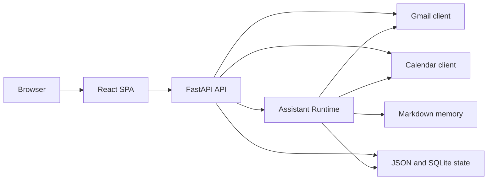

# Architecture

## Overview

The application is a single FastAPI server that serves both the backend API and the React frontend in `frontend/`. Runtime state is stored on disk under `tmp/` and `data/`, which keeps demo mode deterministic and makes local debugging straightforward.

## Main backend modules

- `api.py`: FastAPI routes, frontend serving, background refresh, and demo reset/start endpoints
- `agent/graph.py`: LangGraph-based runtime, decision loop, work-item resumption, and timeline generation
- `agent/approvals.py`: JSON-backed stores for work items, threads, timelines, and run snapshots
- `agent/memory/store.py`: markdown note store used to persist memory candidates
- `email/gmail_client.py`: Gmail adapter with live and demo-mode behavior
- `calendar/gcal.py`: Google Calendar adapter with live and demo-mode behavior
- `demo_data.py`: official demo scripts and dynamic fixture generation

## Frontend

The SPA is loaded from `frontend/index.html` and bootstrapped by `frontend/app.jsx`. Major views:

- `Home.jsx`
- `Email.jsx`
- `Calendar.jsx`
- `Settings.jsx`
- `Chat.jsx`

`Chat.jsx` is the main demo surface. It loads assistant threads, pending work items, and per-thread timeline events from the backend.

## State and persistence

- `tmp/agent_work_items.json`: pending and resolved work items
- `tmp/agent_threads.json`: thread metadata and chat history
- `tmp/agent_timeline.json`: normalized timeline events for the UI
- `tmp/agent_runs.json`: run history
- `tmp/agent_checkpoints.sqlite`: LangGraph checkpoint storage
- `data/memory/`: markdown memory notes
- `tmp/demo_mailbox_state.json` and `tmp/demo_calendar_state.json`: mutable demo state

## Execution modes

- live mode: uses Google OAuth credentials and real provider clients
- demo mode: bypasses login and loads committed fixture templates into local runtime state
- `semi_auto`: asks for confirmation on protected actions
- `auto`: allows more direct execution, while still surfacing blocking work items for human decisions

## Decision engine

The runtime always uses the same state graph, but it does not always use the same decision policy:

- when `OPENAI_API_KEY` and `OPENAI_MODEL` are configured, `AgentRuntime` builds a `LangChainDecisionEngine`
- otherwise, it falls back to the heuristic engine bundled in `agent/graph.py`

This keeps demo mode usable even when no live model is available, while still exercising the same thread, work-item, and timeline plumbing.
