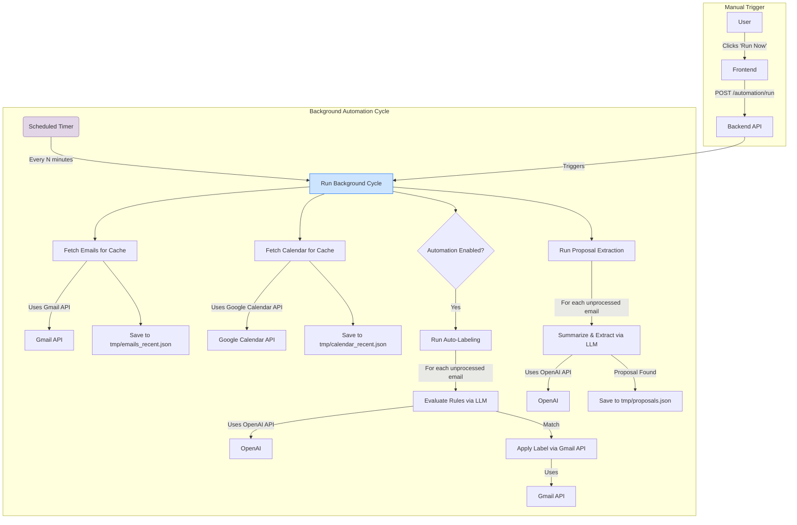

```mermaid
graph TD
    subgraph "Background Automation Cycle"
        A(Scheduled Timer) -- "Every N minutes" --> B[Run Background Cycle];
        
        B --> C[Fetch Emails for Cache];
        C -- "Uses Gmail API" --> Gmail1[Gmail API];
        C --> C_Store["Save to tmp/emails_recent.json"];

        B --> D[Fetch Calendar for Cache];
        D -- "Uses Google Calendar API" --> GCal1[Google Calendar API];
        D --> D_Store["Save to tmp/calendar_recent.json"];

        B --> E{Automation Enabled?};
        E -- "Yes" --> F[Run Auto-Labeling];
        F -- "For each unprocessed email" --> G[Evaluate Rules via LLM];
        G -- "Uses OpenAI API" --> OpenAI;
        G -- "Match" --> H[Apply Label via Gmail API];
        H -- "Uses" --> Gmail2[Gmail API];

        B --> I[Run Proposal Extraction];
        I -- "For each unprocessed email" --> J[Summarize & Extract via LLM];
        J -- "Uses OpenAI API" --> OpenAI2[OpenAI];
        J -- "Proposal Found" --> K["Save to tmp/proposals.json"];
    end

    subgraph "Manual Trigger"
        User -- "Clicks 'Run Now'" --> FE[Frontend]
        FE -- "POST /automation/run" --> API[Backend API]
        API -- "Triggers" --> B
    end

    style A fill:#e1d5e7,stroke:#9673a6
    style B fill:#cde4ff,stroke:#0066ff
```
