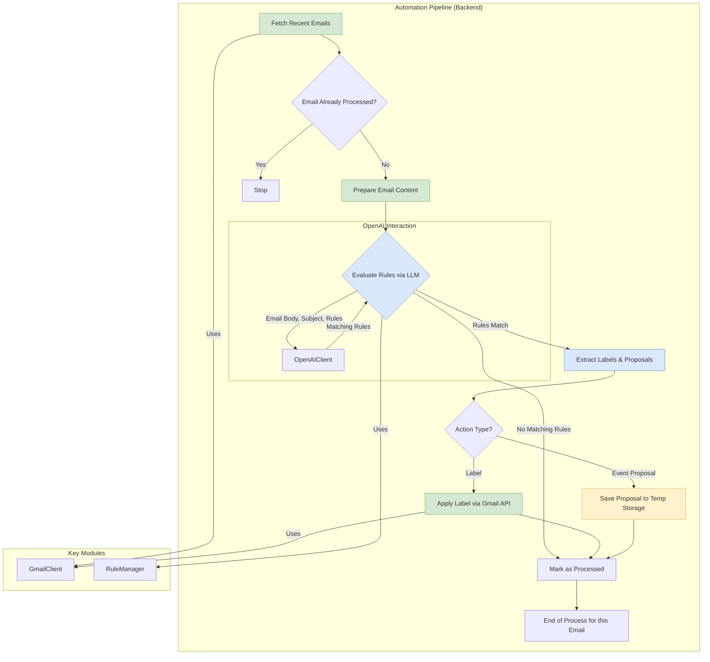

```mermaid
graph TD
    subgraph "Automation Pipeline (Backend)"
        A[Fetch Recent Emails] --> B{Email Already Processed?};
        B -- "No" --> C[Prepare Email Content];
        B -- "Yes" --> End1[Stop];
        
        C --> D{Evaluate Rules via LLM};
        subgraph "OpenAI Interaction"
            D -- "Email Body, Subject, Rules" --> OpenAI_Client[OpenAIClient];
            OpenAI_Client -- "Matching Rules" --> D;
        end

        D -- "No Matching Rules" --> E[Mark as Processed];
        D -- "Rules Match" --> F[Extract Labels & Proposals];

        F --> G{Action Type?};
        G -- "Label" --> H[Apply Label via Gmail API];
        G -- "Event Proposal" --> I[Save Proposal to Temp Storage];

        H --> E;
        I --> E;
        E --> End2[End of Process for this Email];
    end

    subgraph "Key Modules"
        GmailClient["GmailClient"]
        RuleManager["RuleManager"]
        OpenAI_Client
    end

    A -- "Uses" --> GmailClient;
    D -- "Uses" --> RuleManager;
    H -- "Uses" --> GmailClient;

    style A fill:#d5e8d4,stroke:#82b366
    style C fill:#d5e8d4,stroke:#82b366
    style D fill:#dae8fc,stroke:#6c8ebf
    style F fill:#dae8fc,stroke:#6c8ebf
    style H fill:#d5e8d4,stroke:#82b366
    style I fill:#fff2cc,stroke:#d6b656
```
