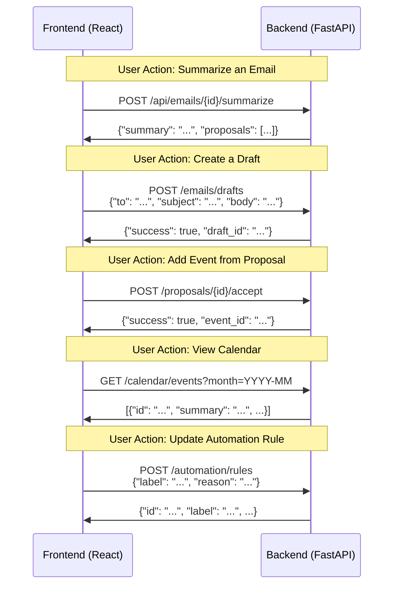

```mermaid
sequenceDiagram
    participant FE as Frontend (React)
    participant BE as Backend (FastAPI)

    Note over FE, BE: User Action: Summarize an Email
    FE->>BE: POST /api/emails/{id}/summarize
    BE->>FE: {"summary": "...", "proposals": [...]}

    Note over FE, BE: User Action: Create a Draft
    FE->>BE: POST /emails/drafts <br> {"to": "...", "subject": "...", "body": "..."}
    BE->>FE: {"success": true, "draft_id": "..."}

    Note over FE, BE: User Action: Add Event from Proposal
    FE->>BE: POST /proposals/{id}/accept
    BE->>FE: {"success": true, "event_id": "..."}

    Note over FE, BE: User Action: View Calendar
    FE->>BE: GET /calendar/events?month=YYYY-MM
    BE->>FE: [{"id": "...", "summary": "...", ...}]

    Note over FE, BE: User Action: Update Automation Rule
    FE->>BE: POST /automation/rules <br> {"label": "...", "reason": "..."}
    BE->>FE: {"id": "...", "label": "...", ...}
```
