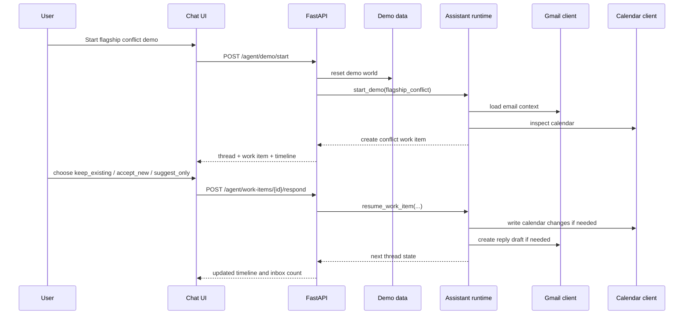

# Demo Conflict Flow

```mermaid
sequenceDiagram
    participant User
    participant UI as Chat UI
    participant API as FastAPI
    participant Demo as Demo data
    participant Agent as Assistant runtime
    participant Gmail as Gmail client
    participant Cal as Calendar client

    User->>UI: Start flagship conflict demo
    UI->>API: POST /agent/demo/start
    API->>Demo: reset demo world
    API->>Agent: start_demo(flagship_conflict)
    Agent->>Gmail: load email context
    Agent->>Cal: inspect calendar
    Agent-->>API: create conflict work item
    API-->>UI: thread + work item + timeline
    User->>UI: choose keep_existing / accept_new / suggest_only
    UI->>API: POST /agent/work-items/{id}/respond
    API->>Agent: resume_work_item(...)
    Agent->>Cal: write calendar changes if needed
    Agent->>Gmail: create reply draft if needed
    Agent-->>API: next thread state
    API-->>UI: updated timeline and inbox count
```
