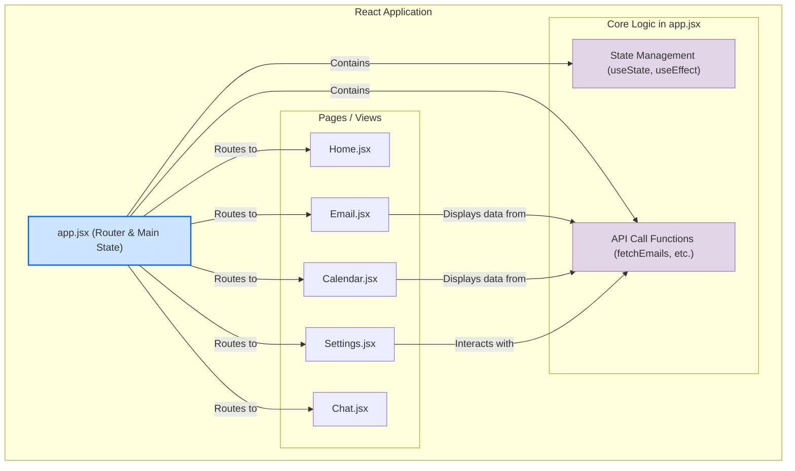

```mermaid
graph TD
    subgraph "React Application"
        App["app.jsx (Router & Main State)"]
        
        subgraph "Pages / Views"
            Home["Home.jsx"]
            Email["Email.jsx"]
            Calendar["Calendar.jsx"]
            Settings["Settings.jsx"]
            Chat["Chat.jsx"]
        end

        subgraph "Core Logic in app.jsx"
            State["State Management (useState, useEffect)"]
            API["API Call Functions (fetchEmails, etc.)"]
        end
    end

    App -- "Routes to" --> Home
    App -- "Routes to" --> Email
    App -- "Routes to" --> Calendar
    App -- "Routes to" --> Settings
    App -- "Routes to" --> Chat

    App -- "Contains" --> State
    App -- "Contains" --> API

    Email -- "Displays data from" --> API
    Calendar -- "Displays data from" --> API
    Settings -- "Interacts with" --> API

    style App fill:#cde4ff,stroke:#0066ff,stroke-width:2px
    style State fill:#e1d5e7,stroke:#9673a6
    style API fill:#e1d5e7,stroke:#9673a6
```
