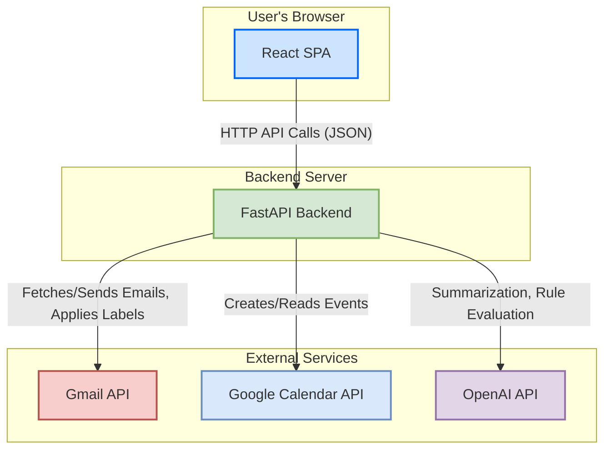

```mermaid
graph TD
    subgraph "User's Browser"
        Frontend[React SPA]
    end

    subgraph "Backend Server"
        Backend_API[FastAPI Backend]
    end

    subgraph "External Services"
        Gmail[Gmail API]
        GCal[Google Calendar API]
        OpenAI[OpenAI API]
    end

    Frontend -- "HTTP API Calls (JSON)" --> Backend_API
    Backend_API -- "Fetches/Sends Emails, Applies Labels" --> Gmail
    Backend_API -- "Creates/Reads Events" --> GCal
    Backend_API -- "Summarization, Rule Evaluation" --> OpenAI

    style Frontend fill:#cde4ff,stroke:#0066ff,stroke-width:2px
    style Backend_API fill:#d5e8d4,stroke:#82b366,stroke-width:2px
    style Gmail fill:#f8cecc,stroke:#b85450,stroke-width:2px
    style GCal fill:#dae8fc,stroke:#6c8ebf,stroke-width:2px
    style OpenAI fill:#e1d5e7,stroke:#9673a6,stroke-width:2px
```
