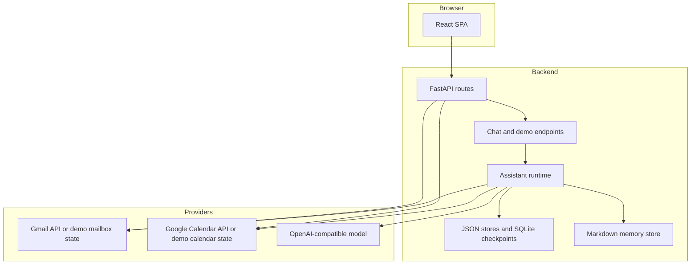

# High-Level Architecture

```mermaid
flowchart TD
    subgraph Browser
        UI[React SPA]
    end

    subgraph Backend
        API[FastAPI routes]
        Chat[Chat and demo endpoints]
        Runtime[Assistant runtime]
        Stores[JSON stores and SQLite checkpoints]
        Memory[Markdown memory store]
    end

    subgraph Providers
        Gmail[Gmail API or demo mailbox state]
        Calendar[Google Calendar API or demo calendar state]
        LLM[OpenAI-compatible model]
    end

    UI --> API
    API --> Chat
    Chat --> Runtime
    Runtime --> Gmail
    Runtime --> Calendar
    Runtime --> LLM
    Runtime --> Stores
    Runtime --> Memory
    API --> Gmail
    API --> Calendar
```
