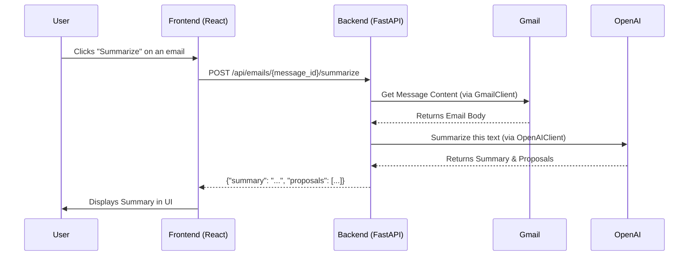

```mermaid
sequenceDiagram
    participant User
    participant FE as Frontend (React)
    participant BE as Backend (FastAPI)
    participant Gmail
    participant OpenAI

    User->>FE: Clicks "Summarize" on an email
    FE->>BE: POST /api/emails/{message_id}/summarize
    BE->>Gmail: Get Message Content (via GmailClient)
    Gmail-->>BE: Returns Email Body
    BE->>OpenAI: Summarize this text (via OpenAIClient)
    OpenAI-->>BE: Returns Summary & Proposals
    BE-->>FE: {"summary": "...", "proposals": [...]}
    FE->>User: Displays Summary in UI
```
