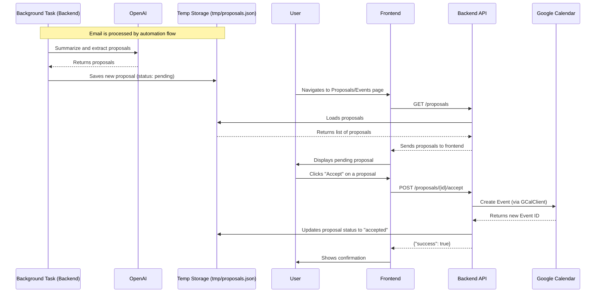

```mermaid
sequenceDiagram
    participant BG as Background Task (Backend)
    participant OpenAI
    participant Storage as Temp Storage (tmp/proposals.json)
    participant User
    participant FE as Frontend
    participant BE as Backend API
    participant GCal as Google Calendar

    Note over BG, Storage: Email is processed by automation flow
    BG->>OpenAI: Summarize and extract proposals
    OpenAI-->>BG: Returns proposals
    BG->>Storage: Saves new proposal (status: pending)

    User->>FE: Navigates to Proposals/Events page
    FE->>BE: GET /proposals
    BE->>Storage: Loads proposals
    Storage-->>BE: Returns list of proposals
    BE-->>FE: Sends proposals to frontend
    FE->>User: Displays pending proposal

    User->>FE: Clicks "Accept" on a proposal
    FE->>BE: POST /proposals/{id}/accept
    BE->>GCal: Create Event (via GCalClient)
    GCal-->>BE: Returns new Event ID
    BE->>Storage: Updates proposal status to "accepted"
    BE-->>FE: {"success": true}
    FE->>User: Shows confirmation
```
