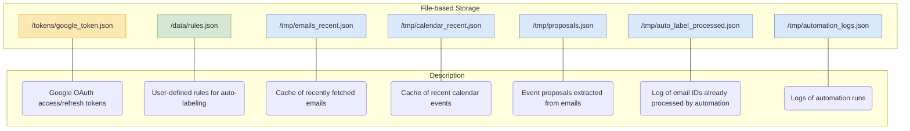

```mermaid
graph TD
    subgraph "File-based Storage"
        A["/tokens/google_token.json"]
        B["/data/rules.json"]
        C["/tmp/emails_recent.json"]
        D["/tmp/calendar_recent.json"]
        E["/tmp/proposals.json"]
        F["/tmp/auto_label_processed.json"]
        G["/tmp/automation_logs.json"]
    end

    subgraph "Description"
        DescA("Google OAuth access/refresh tokens")
        DescB("User-defined rules for auto-labeling")
        DescC("Cache of recently fetched emails")
        DescD("Cache of recent calendar events")
        DescE("Event proposals extracted from emails")
        DescF("Log of email IDs already processed by automation")
        DescG("Logs of automation runs")
    end

    A --- DescA
    B --- DescB
    C --- DescC
    D --- DescD
    E --- DescE
    F --- DescF
    G --- DescG

    style A fill:#fce8b2,stroke:#f5a623
    style B fill:#d5e8d4,stroke:#82b366
    style C fill:#dae8fc,stroke:#6c8ebf
    style D fill:#dae8fc,stroke:#6c8ebf
    style E fill:#dae8fc,stroke:#6c8ebf
    style F fill:#dae8fc,stroke:#6c8ebf
    style G fill:#dae8fc,stroke:#6c8ebf
```
